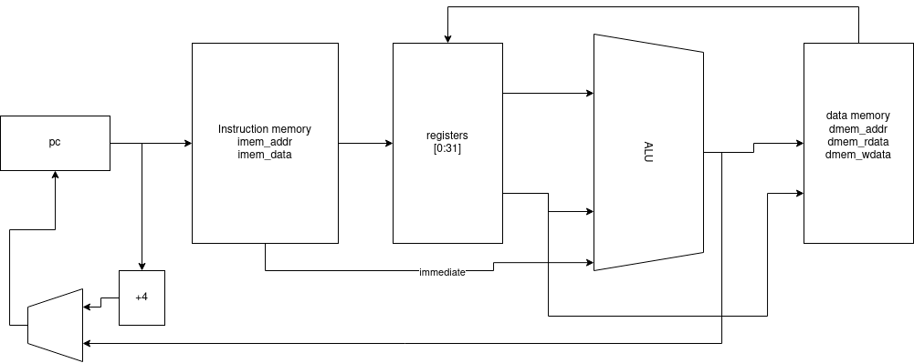
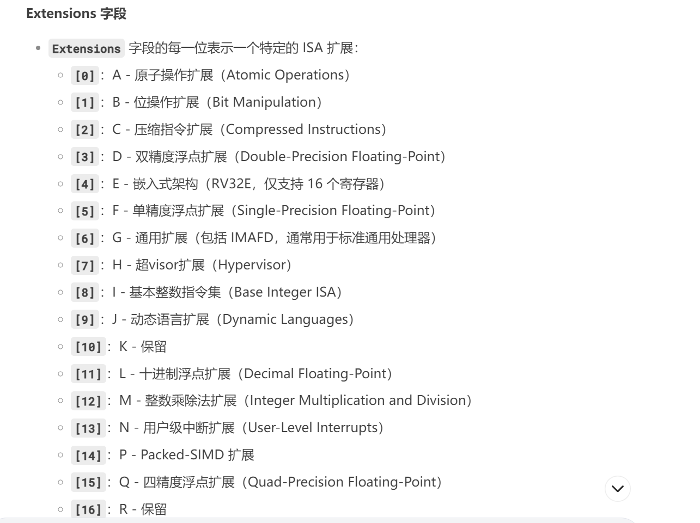
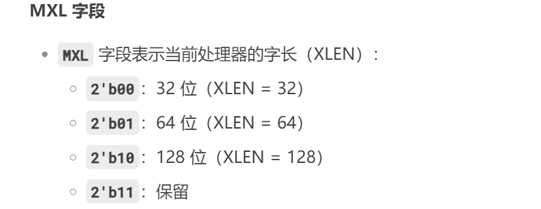
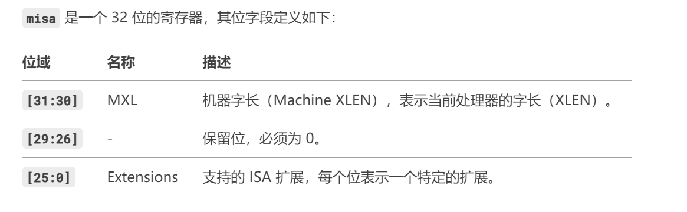
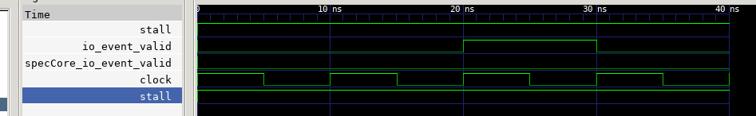

NERV - Naive Educational RISC-V Processor
=========================================

NERV is a very simple single-stage RV32I processor. 
It is equipped with an [RVFI interface](https://github.com/yosyshq/riscv-formal/blob/master/docs/rvfi.md) and is formally verified.




sbt compile
sbt clean compile
sbt "runMain rvspeccore.interface_app"
发现一个史上最傻逼的事情：在错误的目录运行代码导致项目跑不通
这里推荐有sbt的地方的所在文件夹作为项目的根目录，否则会寄了，哎真是逆天

有时候不得不觉得这写的代码是shit
居然不设计顶层模块，直接偷懒

必须在metals中打开导入配置，尽量不要在多个项目中使用metals跳转，否则会崩溃；


考虑的几个问题：
1.尽量少对原始形式化验证代码做修改
2.如果有的CPU缺少这方面的形式化验证，或者不支持部分指令，是报错还是warning? 所以统一的写法要改变
3.使用blackbox把veirlog进行封装，这是最简单的办法

大致思路：
1.用参考模型接参考模型测试下
2.考虑参数传递的问题，如何在参考模型中体现
3.如何接参考模型的测试信号hex文件等
4.找一个参考模型然后运行下看能不能接上去


在ssh服务器上配置公钥：
```shell
ssh-keygen -t rsa -b 4096 -C "1824161941@qq.com"
eval "$(ssh-agent -s)"
ls ~/.ssh
ssh-add -l
cat ~/.ssh/id_rsa.pub
copy
ssh -T git@github.com
git remote -v
git remote set-url origin git@github.com:l1x2h3/rvspeccore_verilog.git
git remote -v
git add .
git commit -m xxx
git push
```

### 这里继续做一个总结

1.关于DUT的选用问题:ysyx的项目貌似大部分都不满足，需要提供差分测试接口，但是提供了又因为CPU的类型不满足，类型满足了又因为是其他语言编写的，没有提供完整的运行文档

2.对CVA6的测试：
测试工作其实一直比较麻烦，尤其是core的复杂度，还没有构建差分测试接口
办法是：自己找办法接线，可以先考虑从基础框架ysyx做起，然后提高core的复杂度

3.信号的参数化问题：表面上看似接口写完了，但是每改一个参数，对应接口都会变
有两种处理思路：一个是要求DUT提供一个参数信息进行编译
另一个是直接实现完备的参数信号差，对于未知或用不上的信号用 ` _ , bx, .* `进行传递


用sby来做形式化验证，那这样就容易处理多了
看一参考TOP的整理处理框架
```verilog
module top (
    input  logic [7:0] a,
    input  logic [7:0] b,
    input  logic       clk
);
    logic [7:0] dut_sum, ref_sum;

    // 实例化 DUT
    dut dut_inst (
        .a(a),
        .b(b),
        .sum(dut_sum)
    );

    // 实例化 Checker
    checker checker_inst (
        .dut_sum(dut_sum),
        .ref_sum(ref_sum)
    );
endmodule
```

#### 以及SBY脚本

```shell
[options]
mode bmc
depth 20

[engines]
smtbmc yices

[script]
read_verilog -formal top_formal.sv
read_verilog nerv_wrapper.sv
read_verilog nerv.sv
read_verilog wrapper.sv
read_verilog CheckerWrapper.sv
prep -top top_formal

[files]
top_formal.sv
nerv_wrapper.sv
nerv.sv
wrapper.sv
CheckerWrapper.sv
```

最后执行命令
`sby -f formal.sby`

目前已完成的过程：
checker
接下来的目标就是让DUT保持一致

```shell
sbt "runMain rvspeccore.checker.Main --assert"
```
Failed


source /mnt/sda/oss-cad-suite/environment
export https_proxy=http://127.0.0.1:7890 http_proxy=http://127.0.0.1:7890 all_proxy=http://127.0.0.1:7890
```sby -f formal.sby```
`rm -rf sby_*`

注意求解器的使用
z3支持全过程调试，但是yices只支持部分（通常会很智障）


这下知道MISA为什么报错了
32位是00



挺神奇：
script.ys脚本实现对sv文件的形式化检查，保证不会出现乱的语法错误
`basecase` 和 `induction`
刚写了一个简单的小栗子举例说明求解器的用法
总结了下求解器选用与debug的办法
开始情况z3求解器会执行好几个回合；然后发现了GPT写这种形式化验证代码容易出的问题：
1. 在checker里面没有给定初值，然后结果崩溃，他的解决办法是在checker里面设定初值，但是我们想法是尝试在top里面给定初值
2. 简单的例子没有考虑到参数的边界问题，导致check进行了多步，但是并行进行的另一个步数出了问题
3. 调试开发过程建议使用z3求解器，yices只告诉出错的点，后面就全部中断了
4. 这个debug模式会因为sby工具性质，导致debug的效率下降，sby往往不能提示到正真出错的地方，抓不住根本原因，调试过程还是需要我们去猜测，我的建议是不建议使用sby工具
因为他能告诉你错了，但是不能告诉你错在哪里


做形式化验证记得加入-formal参数到对应的sv文件，否则无法识别


这里出现了很严重的问题
DUT是三级流水线，而参考模型是单周期的



波形有些逆天
yosys script.ys
```shell
2.14. Executing CHECK pass (checking for obvious problems).
Checking module nerv...
Found and reported 0 problems.

End of script. Logfile hash: f983167f47, CPU: user 1.14s system 0.03s, MEM: 44.63 MB peak
Yosys 0.46+124 (git sha1 d1695ad99, clang++ 14.0.0-1ubuntu1.1 -fPIC -O3)
Time spent: 28% 5x opt_clean (0 sec), 18% 2x check (0 sec), ...
```

头文件是不需要定义的，否则就会被显示重定义


gtkwave formal/engine_0/trace.vcd

Running the simulation testbench
--------------------------------

```
git clone https://github.com/yosyshq/nerv.git
cd nerv
make
```


Running the riscv-formal testbench
----------------------------------

```
git clone https://github.com/yosyshq/riscv-formal.git
cd riscv-formal/cores/nerv
make -j8 check
```

Updating riscv-formal's included nerv core
------------------------------------------

From root `riscv-formal` directory:

```
git subtree pull --prefix cores/nerv git@github.com:YosysHQ/nerv.git main --squash
```

Updating upstream nerv with changes from riscv-formal
-----------------------------------------------------

From root `riscv-formal` directory:

```
git subtree push --prefix cores/nerv git@github.com:YosysHQ/nerv.git main
```

iCEBreaker SOC example
----------------------

See the [iCEBreaker SOC README](examples/icebreaker/README.md)
